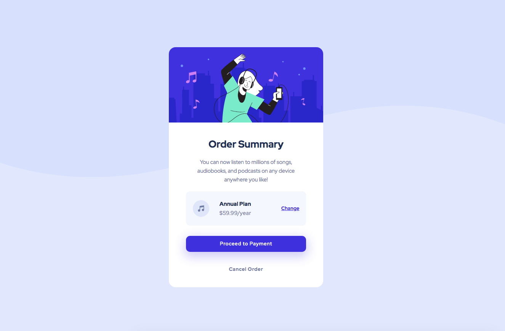

# Frontend Mentor - Order summary card

## Welcome! 👋

This is a challange from the site Frontend Mentor, and the proposal is to compose a card following the layout defined in the challenge.

In this exercise, I could practice a little bit more HTML, CSS, flexbox and it was good training to creating responsive layouts (desktop and mobile).

